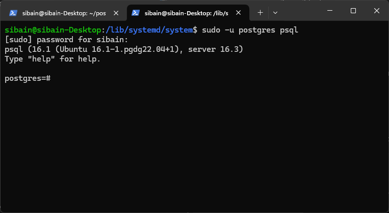
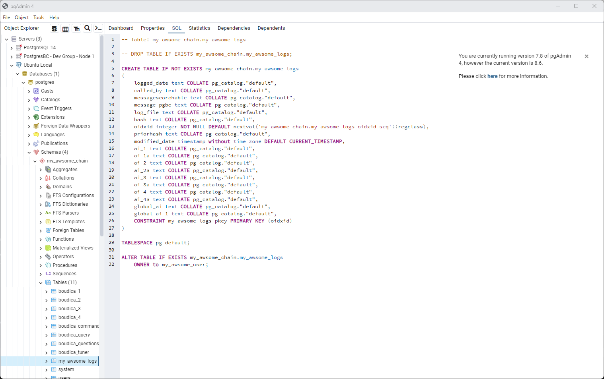
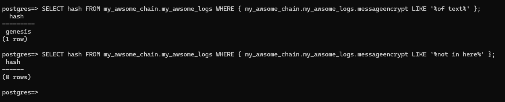

# PostgresBC


+ Getting Started
+ Users
+ Drop and Delete Objects
+ Chains and Schemes
+ Blocks or Tables
+ Smart Contracts
+ Peer-to-Peer Replication
+ More Information

## Getting started  

Once installed either via the Deb package or within a Docker container, it is understandable that you will want to get playing as soon as possible. This is where this section of the README is really useful.

We will start with an empty PostgresBC instance and then do the following using psql:

+ Log in to psql with the postgres user
+ Change the password of the postgres user
+ Initialize PostgresBC without passing a key
+ Create a new user with login privileges
+ Alter the user to add a password
+ Log out with the postgres user and log in with our new user
+ Create a new Chain to hold our log blocks
+ Create a new log Block within that Chain
+ Add data to a Block
+ Searching in an encrypted object
+ Conclusion

### Login to psql with the postgres user

In a command window on a system that has postgres-client installed, type:

```text
sudo -upostgres psql<enter>
```

This will connect you to the PostgresBC instance and may ask for your system password (NOT PostgresBC)  



### Change the password of the postgres user

You do this by typing:

```SQL
ALTER USER postgres WITH PASSWORD 'new password';<enter>
```

### Initialize PostgresBC without passing a key

We are now ready to start using PostgresBC fully.

Let's start by initializing the system. We will let PostgresBC create a key for us, using OpenSSL.

```OIDXQL
initialize '';<enter>
```

The return will be a message stating that the initialization carried out OK or an error message. If an error. please rectify the problem and re-run initialize.

/var/logs/postgresql/postgresql{version}.log  

If you have setup a peer network within your /etc/postgresbc.conf file, then all of the attached nodes will also be initialized.

### Create a new user with login privileges

Now we will create an initial user. We **should not** use the postgres 'super user' for all of our tasks.

```SQL
CREATE ROLE my_awsome_user WITH LOGIN;<enter>
```

Once entered, you will see the message:

```TEXT
CREATE ROLE
```

### Alter the user to add a password

You will now need to add a password.

```SQL
ALTER USER my_awsome_user WITH PASSWORD 'my_awsome_password';<enter>
```

Once entered, PostgresBC will return:

```TEXT
ALTER ROLE
```

Now we will log out of psql and log back in as our new user.

### Log out with the postrgres user and log in with our new user

To do this, enter the following after the prompt:

```TEXT
\q <enter>
```

You should now be back at the command prompt where you need to type:

```TEXT
psql -Umy_awsome_user -dpostgres<enter>
```

You will now be prompted for the password, so enter the one you gave the user.

### Create a new Chain to hold our log blocks

A chain in PostgresBC is an enhanced postgres Schema. If you are unsure about the differences between a Postgresql and other DB platforms schemas, please see the Chain section below.

Here we will be creating a PostgresBC Chain. To do this in your psql command prompt, logged in as your new user type, enter the following:

```SQL
CREATE CHAIN IF NOT EXISTS my_awsome_chain<enter>
```

After a few seconds you should receive the message:

```TEXT
NOTICE:  Your chain is ready for use.
```

### Create a new log Block within that Chain

Blocks in PostgresBC are enhanced postgres Tables. To create a Block within the psql window type, enter:

```SQL
CREATE BLOCK IF NOT EXISTS my_awsome_chain.my_awsome_logs (logged_date TEXT, called_by TEXT, messageencrypt TEXT, log_file TEXT);<enter>
```

All being well, you will have the message below returned to you:

```TEXT
CREATE TABLE
```

This tells you that all is good and that your new Block has been created. So, what have we just done?

When we tell PostgresBC to create a Block it adds a number of special fields into it. These are ones that you have not defined, but are there to enable Web3 and AI Analytics. If you wish to see them, you could try typing the psql command \dn into the command window. However, as you will quickly see, PostgresBC is very locked down. Instead, the best way to examine a Block's structure is to use a tool such as PGAdmin and log in as the postgres user.



You will instantly see that there are far more objects (fields) in place than the 4 that we created. 

If we break these down:  

+ messagesearchable
+ message_pgbc

These are the messageencrypt objects. When you append the word encrypt to an object name, you are instructing PostgresBC to encrypt all data that is sent to the object. These two enable you to view (Only if you have INSERT, UPDATE & SELECT privileges) and Search (Only if you have SELECT privileges).  

+ hash
+ priorhash

These hold a unique hash for this object and also the hash of the object inserted directly before this one.

+ oidxid

This is a unique serial identifier for the Block

+ ai_*

These hold the AI descriptors for this Block based on the Boudica AI thesauruses that have been placed in the Chain.

### Add data to a Block

As you saw in the creation of a block, we added an object that holds encrypted data. In this section we will show you how to add data to the encrypted object and other objects within a block.

In the psql command window, type:

```SQL
INSERT INTO my_awsome_chain.my_awsome_logs (logged_date, called_by, message_encrypt, log_file) VALUES
('06-26-2024 08-38', 'Tutorial', 'This is a small block of text that simon has added for the tutorial', 'README');<enter>
```

This will probably not give you the response that you were expecting! As stated before, PostgresBC is very locked down.

While you have CREATE privileges on your Chain, you do not yet have any access privileges. To do this, you will need to log out of psql

```TEXT
\q<enter>
```

And log back in as the postgres user

```TEXT
su -u postgres psql<enter>
```

Now you are able to set privileges on the data structure.

For this tutorial, we will give my_awsome_user all privileges on the Block.

```SQL
GRANT SELECT, INSERT, UPDATE ON my_awsome_chain.my_awsome_logs TO my_awsome_user;<enter>
```

You will then be returned with:

```TEXT
GRANT
```

Now log back in as my_awsome_user.

When you are at the logged in command prompt, up arrow until you see the insert command and then press the enter key. This should return:

```SQL
INSERT 0 1
```

If it does not, you will see an error stating where there has been an issue with the insert. Follow this and then re-insert the data.

### Searching in an encrypted object

Return to PGAdmin and open up a query tool (Right hand mouse click on the Block). In the query tool type:

```SQL
SELECT hash, message_pgbc, messagesearchable FROM my_awsome_chain.my_awsome_logs;
```

Press the Run button and you will be presented with the results.

As you will see, we have a Genesis hash and both the message fields have hex data in them.

The postgres user is unable to view this data as by default they do not have full access rights.  

Back in your psql command window type:

```SQL
SELECT hash FROM my_awsome_chain.my_awsome_logs;<return>
```

You will see that you can return this object.

Now let us return an encrypted object. To do this, type:

```SQL
SELECT * FROM my_awsome_chain.my_awsome_logs;<enter>
```

You will be returned with a CSV output from your search with the encrypted data shown in plain text.

Next we will do two more searches. The first bringing back the hash using a search within the encrypted object, and the second the same search but this time searching on text that is not in the encrypted object.  

For the first search type:

```SQL
SELECT hash FROM my_awsome_chain.my_awsome_logs WHERE { my_awsome_chain.my_awsome_logs.messageencrypt LIKE '%of text%' };<enter>
```

For the second type:

```SQL
SELECT hash FROM my_awsome_chain.my_awsome_logs WHERE { my_awsome_chain.my_awsome_logs.messageencrypt LIKE '%not in here%' };
```

Before we look at the return, let me explain the query.  

+ Dot notation for blocks and tables

With PostgresBC, whenever we are dealing with tables or blocks we must allways provide the full path. So here we have the Chain 'my_awsome_chain' then a . followed by the block name 'my_awsome_logs

+ Dot notation on encrypted objects

If we want to place a WHERE clause on an encrypted object then we need to add the OIDXQL language additions. These are: 

+ Surrounding the clause with curly braces {}
+ Full . notation on the object names Chain/Schema.Block/Table.Object

In the following image you will see my returned output. The first query gives me a result, while the second is empty. This is because the fiirst query found the text 'of text' within the messageencrypt object, while the second searched for 'not in here' which is not in the object.  



### Conclusion

Working with PostgresBC is almost identical to working with PostgreSQL and because PostgresBC is a fork of PostgreSQL you are able to use the same tools and drivers that you currently use to access postgreSQL with no changes.

The only difference is the addition of Chains, Blocks, Encrypted Objects and user access.

For more indepth tutorials on:

+ The Boudica AI engines SLM
+ The Boudica AI autonomous data management
+ Peer-to-Peer Replication
+ Smart Contracts

Please see our other specific video walk throughs.

## Users

Users are controlled mainly by the standard postgresql user management. So you can create, alter and manage users with the postgres user commands: CREATE ROLE, ALTER ROLE etc.  

It is important to remebere that PostgresBC also has its own rules when it comes to user access of the data.  
To be able to search within encrypted data a user needs the SELECT privilege on the block/table being searched.  
To see encrypted data in its original format, a user needs the SELECT, INSERT & UPDATE privileges on the block being accessed.  
To add block/data to a chain/table, a user must have INSERT, UPDATE privileges for that chain/table.  
The commands DROP, DELETE, UPDATE are not accessible to any user.  

## Drop and Delete Objects

By default, a Web3 data store cannot have objects deleted, updated or dropped. This can run foul of some local data protection laws. To overcome this, PostgresBC comes with the ability to override the standard Web3 immutable data rule.

When the system is initialized, an override file is created within the /etc folder on the system. If you wish to DELETE, DROP or Update data then you have to be logged in as the postgres super user, and at the end of your command you need to append the keys password.

```SQL
DROP BLOCK myBlock:override password;
```

This override will not enable an unauthorized person to search data. Only perform drop, delete and update commands.  

## Chains and Schemas

In PostgreSQL, a schema is similar to a database in other RDMS such as Oracle, MySQL and MSSQL. It is a place where a range of objects are stored and accessed. The same is true of PostgresBC with the addition that when you create a CHAIN it will be pre-populated with the Boudica AI objects, allowing other objects within the Chain to also have access to the PostgresBC AI engine.

## Blocks or Tables

PostgresBC can utilize both a Block and a Table. However to use the Boudica AI engine you must create the object as a Block.  

Both Blocks and Tables can store and have searchable encrypted data.

## Smart Contracts

These are a special type of block that when created will also create a trigger function. The trigger function shell script is placed in the **/var/lib/postgresql/pgbc/sql** folder. To call it, create a block like so:  

CREATE BLOCK IF NOT EXISTS {schema}.{USER}_contract (contractCount SERIAL, your other objects);  

This will automatically trigger the smart contract script.

## Peer-to-Peer Replication

This happens automatically if the node details are placed into the postgresbc.conf file, which can be found in the /etc folder. The make up of peer nodes is:  

```TEXT
node0 <address>  
node0port <port>  
node0user <username>  
node0password <password>  
node0database <database>  
#Next Node
node1 <address>  
node1port <port>  
node1user <username>  
node1password <password>  
node1database <database> 
```

## Further Information

For further information please view our short tutorial videos and visit our website <www.omniindex.io>
